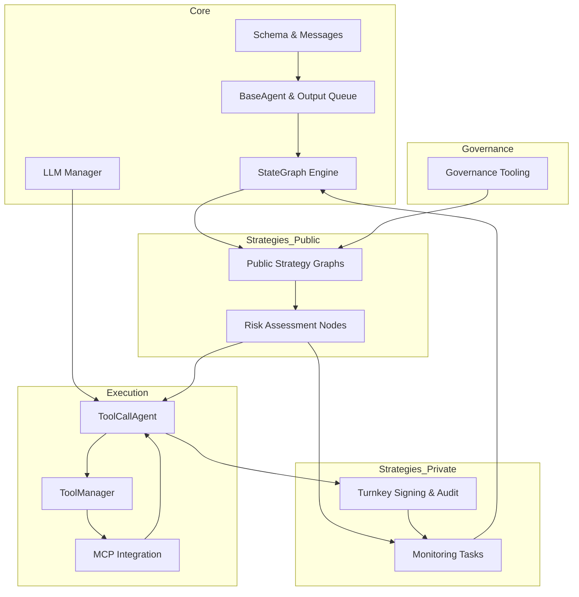

# SpoonOS Agent Architecture Overview

## Module Ownership Boundaries

### `core`
- **Runtime primitives** – Base agent contract with thread-safe queues, memory coordination, and lifecycle controls lives in `spoon_ai/agents/base.py`. It exposes the concurrency locks, state transitions, and shared output queue used by every concrete agent.【F:spoon_ai/agents/base.py†L26-L175】
- **Workflow engine** – `spoon_ai/graph/engine.py` and its builders handle declarative graph construction, routing, and parallel execution, forming the canonical state machine for complex strategies.【F:spoon_ai/graph/engine.py†L1-L139】【F:spoon_ai/graph/builder.py†L1-L200】
- **Model orchestration** – `spoon_ai/llm/manager.py` centralizes provider setup, fallback handling, and load balancing for all LLM calls the agents depend on.【F:spoon_ai/llm/manager.py†L200-L360】
- **Shared schemas** – Typed message, tool, and agent state definitions in `spoon_ai/schema.py` establish uniform contracts for inter-module communication.【F:spoon_ai/schema.py†L1-L59】

### `execution`
- **Tool-mediated action** – The ReAct-style `ToolCallAgent` builds on the core agent to request tools, merge MCP-discovered actions, and surface LLM-selected tool invocations.【F:spoon_ai/agents/toolcall.py†L1-L149】
- **Tool lifecycle management** – `spoon_ai/tools/tool_manager.py` indexes, executes, and dynamically registers tools, providing the execution boundary between agents and external capabilities.【F:spoon_ai/tools/tool_manager.py†L1-L86】
- **MCP connectivity** – MCP integration managers and tool wrappers translate configuration into live transports, enabling execution to call remote MCP services uniformly.【F:spoon_ai/graph/mcp_integration.py†L1-L119】【F:spoon_ai/tools/mcp_tool.py†L18-L123】

### `governance`
- **Domain data ingestion** – The Neo toolkit demo wires governance-specific APIs (candidate votes, committee info) into agent tooling, defining the ownership boundary for governance data products.【F:examples/neo_toolkit_agent_demo.py†L17-L111】【F:examples/neo_toolkit_agent_demo.py†L199-L245】
- **Scenario orchestration** – Governance tasks register dedicated agents and tools that consume the shared runtime but curate domain prompts, policy constraints, and monitoring routines.【F:examples/neo_toolkit_agent_demo.py†L188-L227】【F:examples/neo_toolkit_agent_demo.py†L380-L611】

### `strategies_public`
- **Composable graphs** – Public strategies rely on declarative trading graphs that combine pricing, market analysis, trade execution, and risk assessment nodes with intelligent routing.【F:doc/graph_agent.md†L586-L760】
- **Intent-driven routing** – Strategy graphs use LLM-powered routing to interpret open-ended requests, keeping strategy logic auditable and configurable for broad distribution.【F:doc/graph_agent.md†L636-L666】

### `strategies_private`
- **Custodied execution** – Private strategies layer secure signing, typed data workflows, and audit retrieval through Turnkey tooling for regulated or proprietary flows.【F:examples/turnkey/turnkey_trading_use_case.py†L185-L245】
- **Protected automation** – Monitoring subsystems schedule confidential alerts, enforce retention, and deliver notifications through controlled channels, separating private telemetry from public logic.【F:spoon_ai/monitoring/core/tasks.py†L1-L116】【F:spoon_ai/monitoring/core/scheduler.py†L1-L96】【F:spoon_ai/monitoring/core/alerts.py†L1-L140】

## Strategy & Risk Data/Control Flows

1. **Strategy Agent planning** – User intent is parsed by public strategy graphs to produce a shared state containing query context, routing decisions, and execution logs.【F:doc/graph_agent.md†L591-L706】 The StateGraph runtime owns transitions and persistent checkpoints, ensuring reproducible decision paths.【F:spoon_ai/graph/engine.py†L52-L119】
2. **Risk evaluation loop** – Risk nodes consume the shared state (confidence score, market data) to decide whether to proceed or trigger mitigation before execution.【F:doc/graph_agent.md†L594-L626】【F:doc/graph_agent.md†L708-L742】
3. **Execution tooling** – When actions are required, the Strategy Agent delegates to `ToolCallAgent`, which negotiates tool choice with the LLM and yields normalized tool call payloads.【F:spoon_ai/agents/toolcall.py†L94-L161】 ToolManager resolves the concrete executor and enforces error handling during asynchronous execution.【F:spoon_ai/tools/tool_manager.py†L14-L75】
4. **MCP service bridge** – Strategy outputs can request MCP-backed tools; configuration managers resolve transport credentials and instantiate `MCPTool` adapters that stream results back into state.【F:spoon_ai/graph/mcp_integration.py†L46-L118】【F:spoon_ai/tools/mcp_tool.py†L73-L172】
5. **Risk Agent feedback** – Post-execution, risk assessments update the shared state and can halt or reroute the StateGraph before final response generation.【F:doc/graph_agent.md†L609-L666】【F:doc/graph_agent.md†L732-L760】
6. **Storage & audit** – Private strategy outputs flow into monitoring and custody layers: monitoring tasks persist scheduling metadata and alert history, while Turnkey audit queries provide tamper-evident execution logs for compliance checks.【F:spoon_ai/monitoring/core/tasks.py†L17-L88】【F:examples/turnkey/turnkey_trading_use_case.py†L199-L245】

## Agent-to-Agent (A2A) Communication & x402 Settlement Touchpoints

- **Shared-state coordination** – Within a workflow, agents communicate through StateGraph-managed dictionaries plus the thread-safe output queue, keeping intra-graph agent exchanges atomic without external brokers.【F:spoon_ai/graph/engine.py†L60-L118】【F:spoon_ai/agents/base.py†L26-L83】 This is the preferred path when Strategy and Risk agents co-execute inside one compiled graph.
- **External queue handoffs** – For cross-graph or cross-process collaboration, agents can expose their `ThreadSafeOutputQueue` to dispatcher services or persist snapshots via the monitoring scheduler, enabling eventual consistency between independently deployed agents.【F:spoon_ai/agents/base.py†L26-L175】【F:spoon_ai/monitoring/core/scheduler.py†L22-L96】 An external message bus (Kafka, Redis streams) can subscribe to these outputs to drive asynchronous A2A loops.
- **x402 settlement integration** – Settlement-critical steps (order signing, custody attestations) run through Turnkey services, producing signed transactions and activity logs that can be correlated with graph state for deterministic reconciliation.【F:examples/turnkey/turnkey_trading_use_case.py†L185-L245】 Strategy agents emit settlement intents; execution tooling acquires signatures; monitoring captures the resulting activity IDs for audit. Future x402 queue implementations should map queue events to these signed artifacts while storing hashes in the shared state for traceability.

## Architectural Diagram

